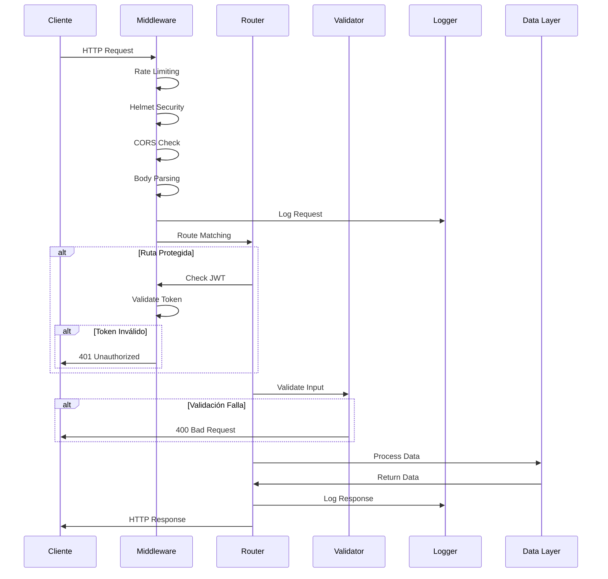
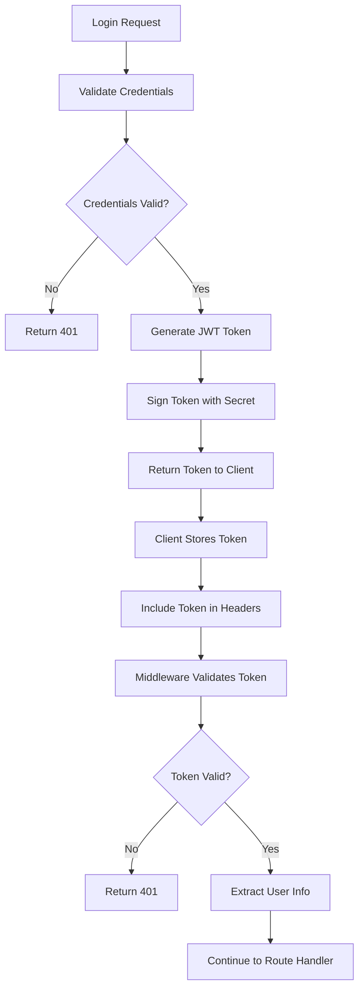
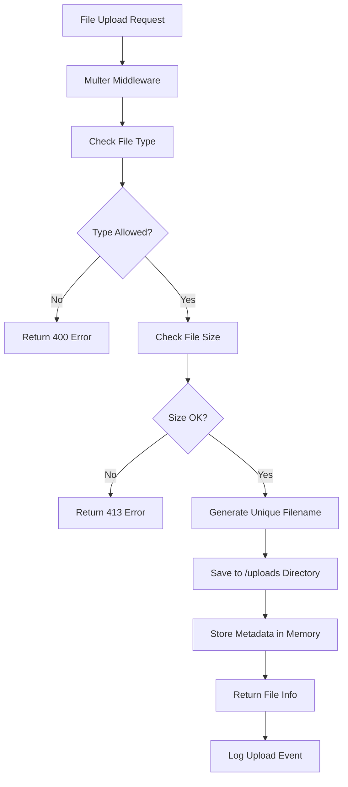

# 🏗️ Arquitectura y Flujo de Datos del Servidor

## 🎯 Visión General de la Arquitectura

### Patrón Arquitectónico: MVC + Middleware

```
┌─────────────────┐    ┌─────────────────┐    ┌─────────────────┐
│     Cliente     │    │   Middleware    │    │   Controller    │
│   (Frontend)    │◄──►│   (Express)     │◄──►│    (Routes)     │
└─────────────────┘    └─────────────────┘    └─────────────────┘
                                │                        │
                                ▼                        ▼
                       ┌─────────────────┐    ┌─────────────────┐
                       │     Logging     │    │     Models      │
                       │    (Winston)    │    │  (Data Layer)   │
                       └─────────────────┘    └─────────────────┘
```

### Capas del Sistema

1. **Capa de Presentación:** Interfaz web (HTML/CSS/JS)
2. **Capa de Middleware:** Seguridad, autenticación, logging
3. **Capa de Lógica:** Controladores de rutas y validación
4. **Capa de Datos:** Simulación de base de datos en memoria
5. **Capa de Infraestructura:** Sistema de archivos, logs

## 🔄 Flujo de Datos Detallado

### 1. Flujo de Request HTTP



### 2. Flujo de Autenticación JWT



### 3. Flujo de Subida de Archivos



## 📊 Estructura de Datos

### Usuarios (En Memoria)

```javascript
const users = [
  {
    id: number,           // Identificador único
    email: string,        // Email único para login
    password: string,     // Hash bcrypt de la contraseña
    name: string,         // Nombre completo
    role: string,         // 'admin' | 'user'
    createdAt: Date,      // Fecha de creación
    lastLogin: Date       // Último login
  }
]
```

### Productos (En Memoria)

```javascript
const products = [
  {
    id: number,           // Identificador único
    name: string,         // Nombre del producto
    price: number,        // Precio en formato decimal
    category: string,     // Categoría del producto
    stock: number,        // Cantidad disponible
    description: string,  // Descripción opcional
    createdAt: Date,      // Fecha de creación
    updatedAt: Date       // Última actualización
  }
]
```

### Archivos (En Memoria)

```javascript
const files = [
  {
    id: string,           // UUID único
    originalName: string, // Nombre original del archivo
    filename: string,     // Nombre en el sistema de archivos
    mimetype: string,     // Tipo MIME del archivo
    size: number,         // Tamaño en bytes
    uploadDate: Date,     // Fecha de subida
    uploadedBy: number,   // ID del usuario que subió
    downloadUrl: string,  // URL para descarga
    path: string          // Ruta completa en el servidor
  }
]
```

## 🔧 Componentes del Sistema

### 1. Servidor Principal (server.js)

**Responsabilidades:**
- Inicialización de Express
- Configuración de middleware global
- Montaje de rutas
- Manejo de errores
- Inicio del servidor HTTP

**Configuración de Middleware (Orden):**
```javascript
1. helmet()              // Headers de seguridad
2. cors()               // Políticas CORS
3. compression()        // Compresión gzip
4. rateLimit()          // Límite de peticiones
5. morgan()             // Logging HTTP
6. express.json()       // Parseo JSON
7. express.urlencoded() // Parseo URL-encoded
8. express.static()     // Archivos estáticos
```

### 2. Sistema de Rutas

#### Rutas de Autenticación (/auth)

```javascript
POST /auth/login        // Iniciar sesión
POST /auth/register     // Registrar usuario
GET  /auth/me          // Info usuario actual (protegida)
```

**Validaciones:**
- Email: Formato válido
- Password: Mínimo 6 caracteres
- Name: No vacío (registro)

#### Rutas de API (/api)

```javascript
// Usuarios
GET    /api/users           // Listar usuarios
GET    /api/users/:id       // Usuario por ID
POST   /api/users           // Crear usuario (protegida)

// Productos
GET    /api/products        // Listar productos
GET    /api/products/:id    // Producto por ID
POST   /api/products        // Crear producto (protegida)
PUT    /api/products/:id    // Actualizar producto (protegida)
DELETE /api/products/:id    // Eliminar producto (protegida)
```

**Query Parameters:**
- `category`: Filtrar por categoría
- `limit`: Limitar resultados
- `page`: Paginación (futuro)

#### Rutas de Archivos (/files)

```javascript
POST   /files/upload         // Subir archivo (protegida)
POST   /files/upload/multiple // Subir múltiples (protegida)
GET    /files               // Listar archivos (protegida)
GET    /files/download/:filename // Descargar archivo
DELETE /files/:id           // Eliminar archivo (protegida)
```

### 3. Middleware Personalizado

#### Autenticación (auth.js)

```javascript
const auth = async (req, res, next) => {
  // 1. Extraer token del header Authorization
  // 2. Verificar que existe
  // 3. Validar con JWT secret
  // 4. Decodificar información del usuario
  // 5. Agregar user info a req.user
  // 6. Continuar al siguiente middleware
}
```

#### Manejo de Errores (errorHandler.js)

```javascript
const errorHandler = (err, req, res, next) => {
  // 1. Log del error
  // 2. Determinar tipo de error
  // 3. Formatear respuesta apropiada
  // 4. Enviar respuesta al cliente
  // 5. Ocultar stack trace en producción
}
```

### 4. Sistema de Logging

#### Configuración Winston

```javascript
const logger = winston.createLogger({
  level: 'info',
  format: winston.format.combine(
    winston.format.timestamp(),
    winston.format.errors({ stack: true }),
    winston.format.json()
  ),
  transports: [
    // Archivo para errores
    new winston.transports.File({ 
      filename: 'logs/error.log', 
      level: 'error' 
    }),
    // Archivo para todos los logs
    new winston.transports.File({ 
      filename: 'logs/combined.log' 
    }),
    // Consola (solo desarrollo)
    new winston.transports.Console()
  ]
});
```

#### Tipos de Logs

1. **HTTP Access Logs:**
   ```json
   {
     "timestamp": "2025-06-22T10:30:00.000Z",
     "level": "info",
     "method": "GET",
     "url": "/api/users",
     "status": 200,
     "responseTime": "15ms",
     "userAgent": "Mozilla/5.0...",
     "ip": "192.168.1.100"
   }
   ```

2. **Error Logs:**
   ```json
   {
     "timestamp": "2025-06-22T10:30:00.000Z",
     "level": "error",
     "message": "Token inválido",
     "stack": "Error: Token inválido\n    at...",
     "userId": 123,
     "endpoint": "/api/users"
   }
   ```

3. **Application Logs:**
   ```json
   {
     "timestamp": "2025-06-22T10:30:00.000Z",
     "level": "info",
     "message": "Usuario logueado: admin@example.com",
     "service": "Servidor Web Completo",
     "userId": 1
   }
   ```

## 🛡️ Seguridad por Capas

### Capa 1: Headers HTTP (Helmet)

```javascript
// Headers configurados automáticamente
X-Content-Type-Options: nosniff
X-Frame-Options: DENY
X-XSS-Protection: 1; mode=block
Strict-Transport-Security: max-age=31536000; includeSubDomains
Content-Security-Policy: default-src 'self'
```

### Capa 2: CORS (Cross-Origin)

```javascript
// Configuración CORS
origin: true,                    // Permite todos los orígenes (dev)
methods: ['GET', 'POST', 'PUT', 'DELETE'],
allowedHeaders: ['Content-Type', 'Authorization'],
credentials: true
```

### Capa 3: Rate Limiting

```javascript
// Configuración de límites
windowMs: 15 * 60 * 1000,       // 15 minutos
max: 100,                        // 100 requests por ventana
message: "Demasiadas peticiones...",
standardHeaders: true,
legacyHeaders: false
```

### Capa 4: Validación de Entrada

```javascript
// Ejemplo de validación
[
  body('email').isEmail().normalizeEmail(),
  body('password').isLength({ min: 6 }).trim(),
  body('name').notEmpty().escape()
]
```

### Capa 5: Autenticación JWT

```javascript
// Configuración JWT
algorithm: 'HS256',
expiresIn: '7d',
issuer: 'servidor-web',
audience: 'cliente-web'
```

## 📈 Performance y Optimización

### Compresión HTTP

```javascript
// Configuración compression
filter: (req, res) => {
  if (req.headers['x-no-compression']) {
    return false;
  }
  return compression.filter(req, res);
},
threshold: 1024,              // Comprimir archivos > 1KB
level: 6                      // Nivel de compresión gzip
```

### Archivos Estáticos

```javascript
// Configuración express.static
maxAge: '1d',                 // Cache por 1 día
etag: true,                   // ETags para cache
lastModified: true,           // Headers Last-Modified
setHeaders: (res, path) => {
  if (path.endsWith('.html')) {
    res.setHeader('Cache-Control', 'no-cache');
  }
}
```

### Multer (Upload de Archivos)

```javascript
// Configuración multer
storage: diskStorage({
  destination: './uploads',
  filename: (req, file, cb) => {
    const uniqueName = `${uuidv4()}-${Date.now()}${path.extname(file.originalname)}`;
    cb(null, uniqueName);
  }
}),
limits: {
  fileSize: 5 * 1024 * 1024,  // 5MB
  files: 5                     // Máximo 5 archivos
},
fileFilter: (req, file, cb) => {
  const allowedTypes = /jpeg|jpg|png|gif|pdf|txt|doc|docx|zip/;
  const isValid = allowedTypes.test(path.extname(file.originalname).toLowerCase());
  cb(null, isValid);
}
```

## 🔄 Estados del Sistema

### Estados de la Aplicación

1. **STARTING:** Inicializando servidor
2. **READY:** Servidor listo para recibir requests
3. **BUSY:** Procesando requests
4. **ERROR:** Error crítico del sistema
5. **SHUTTING_DOWN:** Cerrando conexiones

### Estados de Autenticación

1. **UNAUTHENTICATED:** Sin token
2. **AUTHENTICATED:** Token válido
3. **EXPIRED:** Token expirado
4. **INVALID:** Token inválido

### Estados de Archivos

1. **UPLOADING:** Subida en progreso
2. **UPLOADED:** Subida completada
3. **PROCESSING:** Validando archivo
4. **READY:** Listo para descarga
5. **ERROR:** Error en subida

## 📊 Métricas del Sistema

### Métricas de Request

```javascript
{
  totalRequests: number,        // Total de requests
  successfulRequests: number,   // Requests exitosos (2xx)
  failedRequests: number,       // Requests fallidos (4xx, 5xx)
  averageResponseTime: number,  // Tiempo promedio de respuesta
  peakResponseTime: number,     // Tiempo máximo de respuesta
  requestsPerSecond: number     // RPS actual
}
```

### Métricas de Autenticación

```javascript
{
  totalLogins: number,          // Total de logins
  successfulLogins: number,     // Logins exitosos
  failedLogins: number,         // Logins fallidos
  activeUsers: number,          // Usuarios activos
  tokenValidations: number      // Validaciones de token
}
```

### Métricas de Archivos

```javascript
{
  totalUploads: number,         // Total de uploads
  successfulUploads: number,    // Uploads exitosos
  failedUploads: number,        // Uploads fallidos
  totalStorageUsed: number,     // Bytes usados
  averageFileSize: number,      // Tamaño promedio de archivo
  downloadsCount: number        // Total de descargas
}
```

Esta documentación proporciona una visión completa de la arquitectura interna, flujos de datos y funcionamiento del servidor web, facilitando el mantenimiento y desarrollo futuro del sistema.
