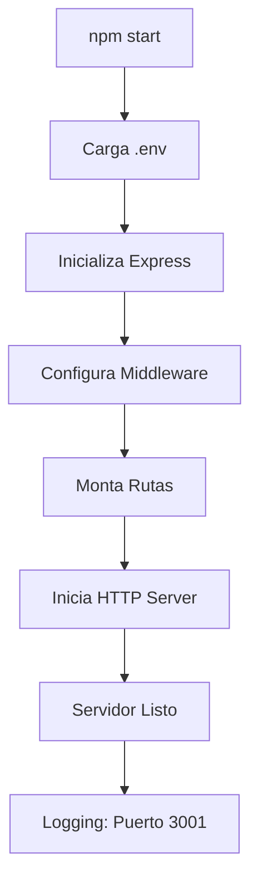
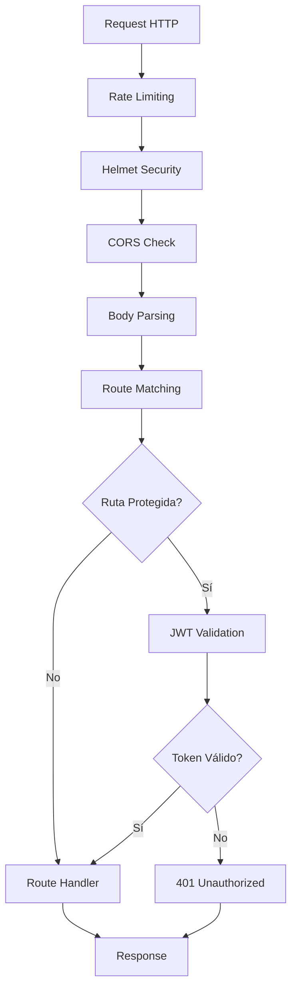
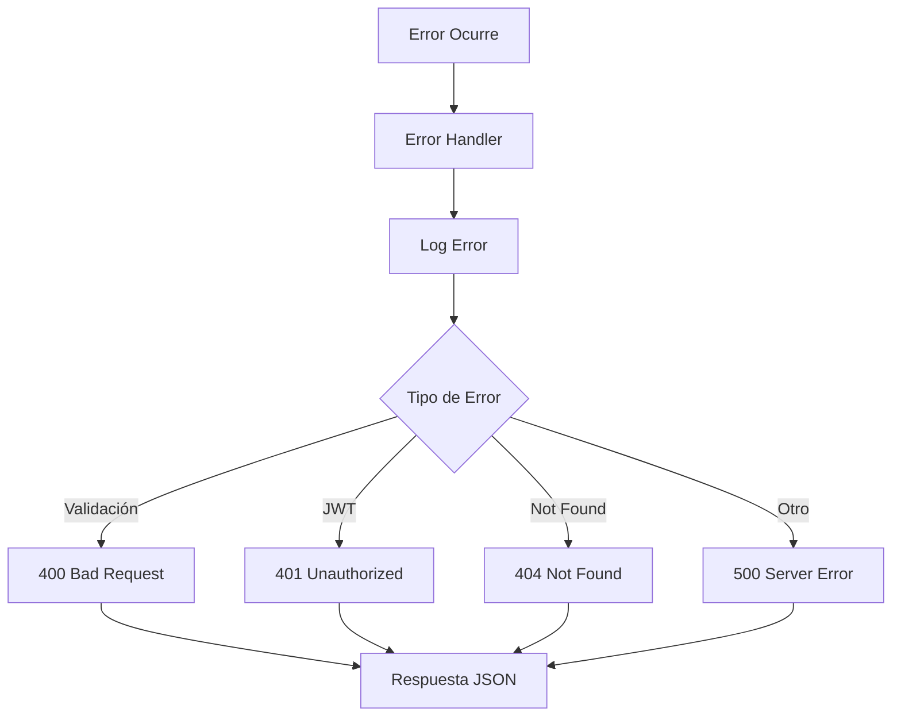

# 📖 Documentación Técnica del Servidor Web

## 📊 Arquitectura del Sistema

### 🏗️ Estructura General

```
SERVIDOR_WEB/
├── src/                          # Código fuente principal
│   ├── server.js                 # Punto de entrada del servidor
│   ├── config/                   # Configuraciones
│   │   └── swagger.js            # Configuración de documentación API
│   ├── middleware/               # Middleware personalizado
│   │   ├── auth.js               # Autenticación JWT
│   │   └── errorHandler.js       # Manejo centralizado de errores
│   ├── routes/                   # Definición de rutas
│   │   ├── api.js                # Rutas principales de la API
│   │   ├── auth.js               # Rutas de autenticación
│   │   └── files.js              # Rutas de gestión de archivos
│   └── utils/                    # Utilidades
│       └── logger.js             # Sistema de logging
├── public/                       # Archivos estáticos públicos
│   └── index.html                # Página principal
├── uploads/                      # Directorio para archivos subidos
├── logs/                         # Directorio para logs del sistema
├── .vscode/                      # Configuración VS Code
└── node_modules/                 # Dependencias de Node.js
```

## 🔧 Componentes del Sistema

### 1. **Servidor Principal (`src/server.js`)**

**Función:** Punto de entrada y configuración principal del servidor

**Responsabilidades:**
- Inicialización de Express
- Configuración de middleware de seguridad
- Configuración de rutas
- Inicio del servidor HTTP

**Flujo de ejecución:**
```javascript
1. Carga variables de entorno (.env)
2. Inicializa Express app
3. Configura middleware de seguridad:
   - Helmet (headers seguros)
   - CORS (políticas de origen cruzado)
   - Rate limiting (límite de peticiones)
   - Compresión gzip
4. Configura parseo de datos (JSON/URL-encoded)
5. Configura archivos estáticos
6. Monta rutas de la API
7. Configura manejo de errores
8. Inicia servidor en puerto especificado
```

**Puertos utilizados:**
- `3001` (por defecto, configurable via `.env`)

### 2. **Sistema de Autenticación (`src/routes/auth.js`)**

**Función:** Gestión de usuarios y autenticación JWT

**Endpoints principales:**
- `POST /auth/login` - Inicio de sesión
- `POST /auth/register` - Registro de usuarios
- `GET /auth/me` - Información del usuario actual

**Flujo de autenticación:**
```
1. Usuario envía credenciales (email/password)
2. Sistema verifica credenciales en base de datos
3. Si son válidas, genera token JWT
4. Token se envía al cliente
5. Cliente incluye token en headers para requests protegidos
6. Middleware auth.js valida token en cada request
```

**Seguridad implementada:**
- Contraseñas hasheadas con bcrypt (salt rounds: 10)
- Tokens JWT con expiración configurable
- Validación de formato de email
- Longitud mínima de contraseñas (6 caracteres)

### 3. **API REST (`src/routes/api.js`)**

**Función:** Endpoints principales para gestión de datos

**Recursos gestionados:**
- **Usuarios:** CRUD completo con roles
- **Productos:** CRUD con filtros y paginación

**Funcionalidades:**
- Validación de datos con express-validator
- Filtrado por parámetros de query
- Paginación de resultados
- Control de acceso basado en roles

**Estructura de respuestas:**
```json
{
  "success": boolean,
  "data": object|array,
  "message": string,
  "count": number,
  "errors": array
}
```

### 4. **Gestión de Archivos (`src/routes/files.js`)**

**Función:** Subida, descarga y gestión de archivos

**Características:**
- Subida individual y múltiple
- Validación de tipos de archivo
- Límites de tamaño configurables
- Nombres únicos con UUID
- Control de acceso por usuario

**Tipos de archivo permitidos:**
- Imágenes: jpeg, jpg, png, gif
- Documentos: pdf, txt, doc, docx
- Comprimidos: zip

**Flujo de subida:**
```
1. Cliente envía archivo via multipart/form-data
2. Multer procesa y valida el archivo
3. Se genera nombre único (UUID + timestamp)
4. Archivo se guarda en directorio /uploads
5. Metadatos se almacenan en memoria
6. Se retorna información del archivo al cliente
```

### 5. **Sistema de Logging (`src/utils/logger.js`)**

**Función:** Registro centralizado de eventos y errores

**Configuración Winston:**
- **Nivel:** info por defecto (configurable)
- **Formato:** JSON estructurado con timestamps
- **Transports:**
  - Consola (solo en desarrollo)
  - Archivo `logs/error.log` (solo errores)
  - Archivo `logs/combined.log` (todos los logs)

**Rotación de logs:**
- Tamaño máximo: 5MB por archivo
- Archivos de respaldo: 5
- Rotación automática

### 6. **Middleware de Seguridad**

**Helmet.js:**
- X-Content-Type-Options: nosniff
- X-Frame-Options: DENY
- X-XSS-Protection: 1; mode=block
- Strict-Transport-Security (HSTS)

**CORS:**
- Permite todos los orígenes en desarrollo
- Headers personalizados permitidos
- Métodos HTTP: GET, POST, PUT, DELETE

**Rate Limiting:**
- 100 peticiones por ventana de 15 minutos
- Por dirección IP
- Respuesta HTTP 429 cuando se excede

**Express Validator:**
- Validación de entrada en tiempo real
- Sanitización de datos
- Mensajes de error personalizados

## 🔄 Flujo de Operación

### Inicio del Servidor



### Procesamiento de Request



### Gestión de Errores



## 📊 Monitoreo y Observabilidad

### Métricas Disponibles

1. **Logs de Acceso:**
   - IP del cliente
   - Método HTTP
   - URL solicitada
   - Código de respuesta
   - Tiempo de respuesta
   - User agent

2. **Logs de Error:**
   - Stack trace completo
   - Timestamp
   - Nivel de severidad
   - Contexto adicional

3. **Métricas de Performance:**
   - Tiempo de procesamiento por endpoint
   - Número de requests por minuto
   - Errores por tipo

### Archivos de Log

```
logs/
├── error.log          # Solo errores (nivel error)
├── combined.log       # Todos los logs
└── access.log         # Logs de acceso HTTP (si se configura)
```

## 🔧 Configuración Avanzada

### Variables de Entorno

```env
# Servidor
PORT=3001                    # Puerto del servidor
NODE_ENV=development         # Entorno (development/production)

# JWT
JWT_SECRET=clave_secreta     # Clave para firmar tokens
JWT_EXPIRES_IN=7d           # Tiempo de expiración

# Aplicación
API_VERSION=v1              # Versión de la API
APP_NAME=Servidor Web       # Nombre de la aplicación

# Archivos
MAX_FILE_SIZE=5242880       # Tamaño máximo (5MB)
UPLOAD_PATH=./uploads       # Directorio de subida

# Logging
LOG_LEVEL=info              # Nivel de logging
LOG_FILE=./logs/app.log     # Archivo de log
```

### Configuración de Producción

**Recomendaciones:**
1. **Variables de entorno:**
   ```env
   NODE_ENV=production
   JWT_SECRET=clave_muy_segura_y_larga
   LOG_LEVEL=warn
   ```

2. **Proxy reverso (Nginx):**
   ```nginx
   server {
       listen 80;
       server_name mi-servidor.com;
       
       location / {
           proxy_pass http://localhost:3001;
           proxy_set_header Host $host;
           proxy_set_header X-Real-IP $remote_addr;
       }
   }
   ```

3. **Process Manager (PM2):**
   ```json
   {
     "name": "servidor-web",
     "script": "src/server.js",
     "instances": "max",
     "exec_mode": "cluster",
     "env": {
       "NODE_ENV": "production"
     }
   }
   ```

## 🧪 Testing y Debugging

### Testing Manual

**Con curl:**
```bash
# Test login
curl -X POST http://localhost:3001/auth/login \
  -H "Content-Type: application/json" \
  -d '{"email":"admin@example.com","password":"password"}'

# Test endpoint protegido
curl -X GET http://localhost:3001/api/users \
  -H "Authorization: Bearer YOUR_TOKEN"
```

**Con Thunder Client (VS Code):**
- Usa el archivo `api-examples.http`
- Endpoints preconfigurados
- Variables de entorno para tokens

### Debugging

**VS Code Debug Configuration:**
```json
{
  "name": "Debug Servidor",
  "type": "node",
  "request": "launch",
  "program": "${workspaceFolder}/src/server.js",
  "env": {
    "NODE_ENV": "development",
    "DEBUG": "*"
  }
}
```

**Logs en tiempo real:**
```bash
# Ver logs combined
tail -f logs/combined.log

# Ver solo errores
tail -f logs/error.log

# Filtrar por nivel
grep "error" logs/combined.log
```

## 🚨 Troubleshooting

### Problemas Comunes

1. **Puerto ocupado:**
   ```
   Error: EADDRINUSE: address already in use :::3001
   ```
   **Solución:** Cambiar puerto en `.env` o matar proceso:
   ```bash
   # Windows
   netstat -ano | findstr :3001
   taskkill /PID <PID> /F
   
   # Linux/Mac
   lsof -ti:3001 | xargs kill -9
   ```

2. **Token JWT inválido:**
   ```json
   {"success": false, "message": "Token inválido"}
   ```
   **Solución:** Verificar que JWT_SECRET coincida y token no haya expirado

3. **Error de permisos en uploads:**
   ```
   Error: EACCES: permission denied
   ```
   **Solución:** Verificar permisos del directorio:
   ```bash
   chmod 755 uploads/
   ```

4. **Memoria insuficiente:**
   **Solución:** Aumentar límite de Node.js:
   ```bash
   node --max-old-space-size=4096 src/server.js
   ```

### Logs de Diagnóstico

**Habilitar debug completo:**
```bash
DEBUG=* npm start
```

**Ver estadísticas de memoria:**
```javascript
// Agregar al servidor
setInterval(() => {
  const used = process.memoryUsage();
  console.log('Memory usage:', {
    rss: Math.round(used.rss / 1024 / 1024) + ' MB',
    heapTotal: Math.round(used.heapTotal / 1024 / 1024) + ' MB',
    heapUsed: Math.round(used.heapUsed / 1024 / 1024) + ' MB'
  });
}, 30000);
```

Esta documentación proporciona una visión completa del funcionamiento interno del servidor web, facilitando el mantenimiento, debugging y escalabilidad del sistema.
